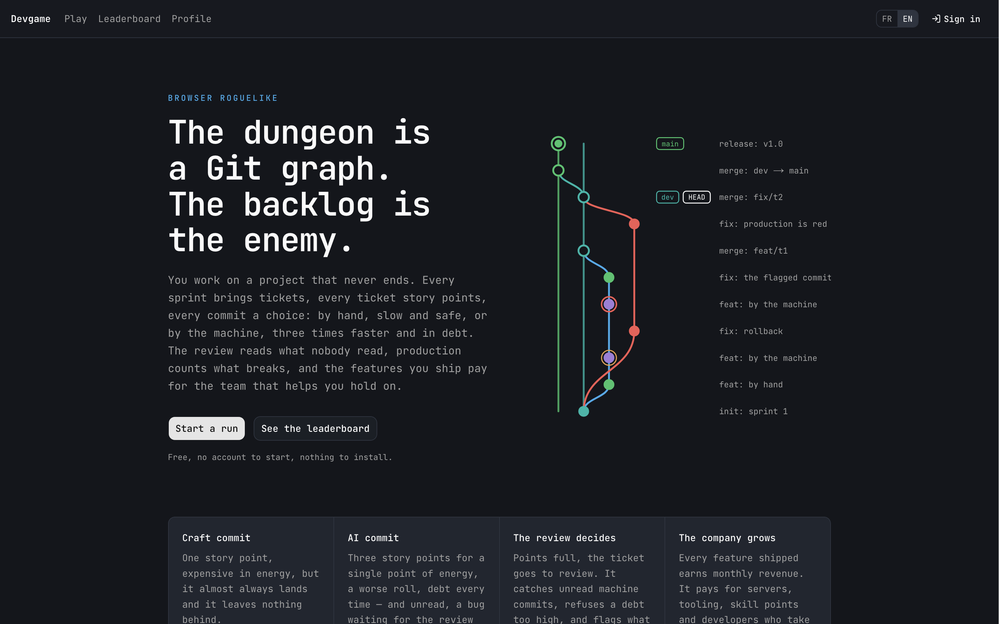

# Devgame

A browser roguelike whose dungeon is a **Git graph written as you play**. You
are a developer on a project that never ships. Every sprint brings tickets;
every ticket is story points to fill, one commit at a time; every commit is a
choice between writing it yourself and letting the machine write it. The
review decides what lands, production decides whether you keep your job, and
the money your features earn buys you the team and the tooling to hold on a
little longer.



There is no end. A run stops in **burnout** (you ran out of energy) or with
**production firing you** (it ran out of patience). The score is what you held.

## The game in one page

**Two hands.** A craft commit costs energy, fills one story point and almost
always lands. A machine commit costs one energy, fills three points, fails
more often, adds technical debt and — unread — ships bugs. Every roll's odds,
cost, points and debt are printed on the card before you choose.

**Tickets, not paths.** Nothing on the graph exists before it is written. A
ticket is a demand with story points; its commits appear in its own column as
you write them, forking from `dev` and merging back. `main` only ever receives
the sprint merge and the release.

**The review has the floor.** Points full, the ticket goes to review. The
reviewer reads every machine commit nobody read, catches bugs at a rate, and
refuses a codebase over its debt ceiling. Accepted, *you* press merge and the
merge costs the turn. Refused, the caught commits are flagged, the next
backlog ticket opens beside yours so the sprint keeps its rhythm, and you
choose: start over (`git reset --hard`) or carry on and fix.

**Every detour has a target.** A *fix* is offered only when the review flagged
a commit, and takes the oldest bug out. A *refactor* is offered only when a
commit on the ticket cost debt — every commit remembers what it cost — and
takes exactly that back. *Squash* needs unread machine commits, *rebase* needs
`dev` to have moved. *Docs* and *risky* are always there.

**Two gauges, two endings.** Energy is spent by commits and reviews, returned
by merges and by *taking a breath* — a turn without code that gives less back
for every extra ticket you hold, so a crowded board is one you cannot rest on.
Production's patience fills on incidents, on refused reviews and on every
backlog ticket a sprint had to force on you; a clean sprint brings it down.

**The backlog is the enemy.** Tickets arrive every sprint, more of them as the
run goes on. A ticket left waiting past its grace sprint is assigned to you
anyway. Every open ticket beyond the first taxes energy and takes a percentage
off every roll. Hotfixes forced open by production do not count: the ticket is
the punishment.

**The company.** Every feature shipped earns monthly revenue for the rest of
the run, three paydays a sprint. Money buys servers (how many features
production can carry), marketing, tooling, an AI supervisor, skill points at a
rising price, and **developers** who take the oldest backlog features and land
them alone — one at a time for a junior, two for a mid, three for a senior —
and leave if you cannot pay them. A four-branch **skill tree** (CI/CD, DevOps,
Management, Profile) spends the points a sprint earns.

**Orders of magnitude.** The run climbs tiers on what it has earned: a
thousand euros, then ten times that, up to six. Each tier's features earn
and weigh five times more, the shop shows one greyed rung of the next tier
(servers → datacenter → region → orbital station → Dyson swarm → Death Star),
sites bring their teams, companies can be bought, and a share of a market
with eight competitors on it sets what the features really earn. The look
follows: four key palettes, interpolated, never a switch.

**Never the same sprint.** Customers' bugs with a deadline, VIP requests the
team will not take, the codebase asking for its own refactor, migrations
that cost debt and buy servers. A sprint objective drawn at every start.
Eleven things that happen to the company and ask it a question — a client,
a competitor, the press, the regulator, and from the fourth tier the system
itself. From the third tier the log has a voice of its own, and the words
on the buttons glide with the tier. Nothing says what the company is;
everything lets you read it.

**What the site keeps, and what it does not.** A page-view counter with
nobody in it: a day, a page from a closed list, a language, two counts.
No cookie, no address, no click. A signed-in player can report a bug from
the account menu — bounded fields, a honeypot, a human pace, a few an hour
— and the report is read in the local admin panel, never on the site.

**Measured, not guessed.** `bun run sim` plays hundreds of headless runs per
policy. The current numbers give every way of playing both endings: the
machine played with reviews delivers the most and gets fired for it, the
crafting hand splits evenly between the two, and the machine played blind dies
in three sprints.

The full specification is [docs/game-design.md](docs/game-design.md); the
engine implements it, and a rule contradicting the doc is a bug in one of the
two.

## Stack

Bun 1.3 · Next.js 16 (App Router, Turbopack) · React 19 · TypeScript (strict) ·
Tailwind CSS 4 + shadcn/ui (dark only) · Zustand 5 · Zod 4 · Biome 2.5 ·
next-intl 4 (FR default, EN) · Pixi.js 8 · @ghom/booyah 1.3 · Prisma 7 +
PostgreSQL 17 · Better Auth

## Getting started

**Just the game, no server.** With no `.env` at all the app runs offline: the
game plays against `localStorage`, and sign-in, the profile, cloud saves and
the leaderboard are simply absent — the header does not even show them.

```bash
bun install
bun run dev                 # http://localhost:3000
```

**With accounts and a leaderboard.** One command sets a machine up: it
writes a `.env` with development values and random secrets, starts the
Postgres container from `docker-compose.yml`, waits for it, applies the
migrations and generates the client.

```bash
bun run init                # .env + Docker + migrations + the admin panel
bun run dev                 # http://localhost:3000
```

The admin panel is a small server of its own on http://127.0.0.1:3100,
started with the database by `bun run init` and `bun run db:up`, behind
the `ADMIN_PASSWORD` the `.env` carries: visit counts, accounts (ban,
delete), bug reports. It listens on the loopback address only and reads
whatever `DATABASE_URL` points at, so a machine set up against the
production database administers production. `bun run admin` runs it in the
foreground, `bun run admin:stop` ends the background one.

`bun run init --offline` writes a `.env` for the offline game only,
`--no-docker` writes the file and stops there, `--force` overwrites an
existing `.env`, and `POSTGRES_PORT=5500 bun run init` picks another port.
The same by hand:

```bash
cp .env.example .env

openssl rand -hex 32        # -> BETTER_AUTH_SECRET
openssl rand -hex 32        # -> CRON_SECRET
openssl rand -hex 32        # -> DAILY_SEED_SECRET

bun run db:up               # Postgres 17 on port 5443
bun run db:migrate          # create and apply migrations
bun run dev                 # http://localhost:3000
```

`DATABASE_URL` is the switch: absent, the app is offline; present,
`BETTER_AUTH_SECRET` and `DAILY_SEED_SECRET` become required and
`src/lib/env.ts` fails at start-up naming the missing one. `CRON_SECRET` only
guards the routes under `/api/cron`, which stay off without it.

Even online the game needs no account: `/play` works signed out, against
`localStorage`. Signing in is what buys you cloud saves and the leaderboard.

**Signing in.** In development the magic link is printed to the server log —
copy it from the terminal and paste it into the browser. No email provider is
wired, so `sendMagicLink` in `src/lib/auth.ts` throws in production: until you
implement it or fill in the Google OAuth pair, nobody can sign in to a deployed
instance. Decide which before launch, not after.

## Commands

```bash
bun run check       # typecheck + lint + tests — run this before you are done
bun run dev         # dev server
bun run build       # production build
bun run sim         # headless balance simulator (scripts/sim.ts)
bun run init        # .env with dev values, Postgres container, migrations, admin panel (scripts/init.ts)
bun run db:up       # Postgres container, then the admin panel in the background
bun run admin       # the admin panel in the foreground, http://127.0.0.1:3100
bun run admin:stop  # end the background admin panel
bun run db:up       # start Postgres (POSTGRES_PORT=5500 to move the port)
bun run db:migrate  # create and apply a migration
bun run db:deploy   # apply committed migrations
bun run db:studio   # browse the data
```

`bun run sim` plays runs without a renderer, over many seeds and a fixed policy,
to catch states the engine cannot leave and to produce balance statistics. It is
the only way to tell whether a number in `balance.ts` is wrong before a human
plays fifty runs.

## What you get

- **A pure rules engine.** `src/game/core/` has no Pixi, no React, no clock and
  no `Math.random()`: randomness comes from a seeded PRNG carried in the run
  state. The same seed and the same actions always produce the same run.
- **Every number in one file.** `src/game/core/balance.ts` holds the tunables —
  energy costs, success rates, story points, debt gains, ticket cadence,
  production's patience, revenue. A literal inside a rule is a bug waiting to
  be untunable.
- **Readable randomness.** Success percentage, energy cost, points and debt
  are shown before you choose. Technical debt is shown as a fuzzy range, exact
  once you have the Linter or Œil de lynx.
- **A git graph drawn like a git client.** Continuous lanes, refs in a gutter,
  conventional-commit subjects, revealed at the pace of the effects.
- **An idle clock.** Left alone, the run keeps moving: the rest button presses
  itself, and with the AI supervisor bought it plays the obvious move. Those
  are ordinary actions in the run's log; nothing in the engine reads the clock.
- **Cloud saves and a leaderboard** derived from the runs table, with a daily
  seed mode: everyone plays the same map on the same UTC day.
- **FR and EN** through next-intl. The engine emits `{ key, params }`, never
  strings; React and the Pixi scene translate.
- **A production image** — multi-stage Dockerfile, non-root, healthchecked, with
  migrations applied at container start.

## How a run is stored

A run is its **seed plus the ordered list of player actions** — nothing else. No
board state, no score, no snapshot. That has three consequences worth knowing
before you touch the engine:

- Saves are tiny, so autosave is cheap and works in `localStorage` too.
- Scores are not forgeable: `submitRun` replays the action log server-side and
  writes what the engine computed. No DTO carries a score field; the number the
  client shows is a preview.
- The engine must stay deterministic. A `Date.now()` in a rule makes yesterday's
  runs unreplayable and silently breaks the leaderboard.

## Layout

```
messages/        fr.json (source of truth) and en.json
prisma/          schema and migrations
scripts/         sim.ts — headless balance simulator
src/
  app/[locale]/
    (site)/      landing, leaderboard, profile, login — scrolls, has a footer
    (app)/play/  the run — fills the window, never scrolls
  app/api/       auth, health, cron — outside the locale segment
  components/
    ui/          shadcn primitives
    shell/       header, footer, locale switch, auth menu
    landing/     the git graph on the landing page
    game/        the canvas mount point
    hud/         resource bar, ticket bar, action panel, board, review,
                 company, skill tree, info column, log drawer
  game/
    core/        pure deterministic rules — no Pixi, no React, no clock
    content/     data tables: skills, relics, tree, upgrades, team, events
    dto/         zod schemas and the server-side replay
    chips/       booyah flow — scene tree, camera, effect queue
    render/      Pixi 8 — the git graph, theme, coordinates, storyboard
    bridge/      zustand store, snapshot and mountGame()
  i18n/          routing, navigation, request config
  lib/           env, db, auth, session, cron, server actions, storage
tests/           bun:test
docs/            game design, maintenance, database, hosting
```

`CLAUDE.md` documents the invariants; read it before changing anything under
`src/game/` or `src/lib/`. [docs/maintenance.md](docs/maintenance.md) is the
maintainer's manual: how to add a game element, change a rule, version a save
or move a DTO, and what silently breaks when a step is skipped.

## Deployment

Built for **Coolify on a single VPS**: migrations run at container start, so
deploying is a push. It also runs unchanged on Vercel, Railway, Render, Fly or
plain Docker.

```bash
docker build --target runner -t devgame .
docker run -p 3000:3000 --env-file .env devgame
```

Read [docs/hosting.md](docs/hosting.md) — it covers the machine, the wildcard
DNS trick, the one-Postgres-many-databases layout, scheduled jobs, backups and
capacity. [docs/database.md](docs/database.md) covers the schema, the index
rules and the one index Prisma cannot express.

## Licence

MIT.
