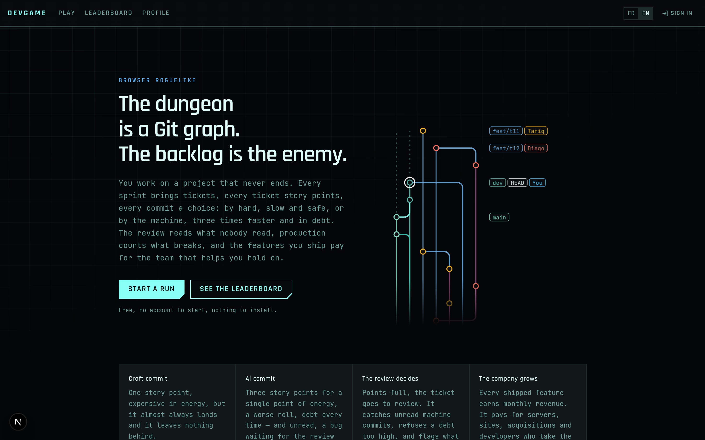

# Devgame

A browser roguelike whose dungeon is a **Git graph written as you play**. You
are a developer on a project that never ships. Every sprint brings tickets;
every ticket is story points to fill, one commit at a time; every commit is a
choice between writing it yourself and letting the machine write it. The
review decides what lands, production decides whether you keep your job, and
the money your features earn buys the team and tooling to hold on a little
longer.



There is no end. A run stops in **burnout** (no energy left), with
**production firing you** (no patience left), or **caught** after a failed
hack. The score is what you held.

## The game in one page

- **Two hands.** A craft commit costs energy, fills one story point, almost
  always lands; a machine commit costs one energy, fills three, fails more,
  adds debt and, unread, ships bugs. A reviewer reads unread machine commits
  before a ticket merges.
- **Two gauges.** Energy, and production's patience. The backlog grows every
  sprint, and every open ticket beyond the first taxes energy and every roll.
- **The company.** Features earn revenue that buys servers, tooling, an AI
  supervisor and developers; six tiers of magnitude, from servers to the
  Death Star.
- **Measured, not guessed.** Online, every run is sent home without its player
  (a seed and its decisions), replayed on the server and digested on the admin
  Balance page, exportable as Markdown for a model; `bun run sim` plays
  hundreds of headless runs per policy.
- **What the site keeps.** A page-view counter with nobody in it (no cookie,
  no address, no click), and bug reports from signed-in players (bounded
  fields, a honeypot, a human pace, a few an hour), read only in the local
  admin panel.

Full specification: [docs/game-design.md](docs/game-design.md). The engine
implements it; a rule contradicting it is a bug in one of the two.

## Stack

Bun 1.3 · Next.js 16 (App Router, Turbopack) · React 19 · TypeScript (strict) ·
Tailwind CSS 4 + shadcn/ui (dark only) · Zustand 5 · Zod 4 · Biome 2.5 ·
next-intl 4 (FR default, EN) · Pixi.js 8 · @ghom/booyah 1.3 · Prisma 7 +
PostgreSQL 17 · Better Auth

## Getting started

### Offline: just the game

With no `.env` the app runs **offline** against `localStorage`; sign-in,
profile, cloud saves, leaderboard and bug reports are absent, header included.

```bash
bun install
bun run dev                 # http://localhost:3000
```

### Online, on your machine: `bun run init`

Needs Docker Desktop or a Docker daemon. `bun run init` copies `.env.example`
to `.env` (if absent), fills the empty secrets with random values, starts the
Postgres container from `docker-compose.yml`, waits for it, installs
dependencies if needed, applies the migrations, generates the client, loads the
development fixtures, and starts the admin panel in the background.

```bash
bun install
bun run init                # .env + Docker + migrations + fixtures + admin panel
bun run dev                 # http://localhost:3000
```

| Command | What it does |
| --- | --- |
| `bun run init` | online setup, as above |
| `bun run init --offline` | copies `.env.example` with the database commented out, no Docker |
| `bun run init --no-docker` | copies `.env.example` and stops there |
| `bun run init --no-fixtures` | leaves the database empty |
| `bun run init --force` | overwrites an existing `.env` |
| `POSTGRES_PORT=5500 bun run init` | picks another port for Postgres |

Later, `bun run db:up` restarts the database and the admin panel;
`bun run admin:stop` ends the panel.

**The admin panel** is its own server on http://127.0.0.1:3100, behind the
`.env`'s `ADMIN_PASSWORD`: visit counts, accounts (ban, delete), runs, bug
reports, the Balance page. Loopback only, it reads whatever `DATABASE_URL`
points at: set up against the production database, it administers
production. `bun run admin` runs it in the foreground.

**The fixtures** (`bun run fixtures`, `scripts/fixtures.ts`): thirteen
accounts at every level; their runs on the classic board and today's and
yesterday's daily; a run to resume, one abandoned, one refused by the server;
a suspended player the board must hide; a month of page views; run samples
for the Balance page; bug reports in every status. Every run was *played* by
the headless policies of `scripts/lib/policy.ts` and scored by `replayRun`,
like a submission. Sign in as `<name>@fixtures.devgame.local` (`ada`, `linus`,
`grace`…) with the magic link from the terminal. Reloading replaces them;
`--clean` removes them. The loader refuses a database not on this machine.

**Signing in** in development: copy the magic link from the server log into
the browser. No email provider is wired, so `sendMagicLink`
(`src/lib/auth.ts`) throws in production: until you implement it or fill in
the Google OAuth pair, nobody can sign in to a deployed instance.

**By hand**, without `init`:

```bash
cp .env.example .env

openssl rand -hex 32        # -> BETTER_AUTH_SECRET
openssl rand -hex 32        # -> CRON_SECRET
openssl rand -hex 32        # -> DAILY_SEED_SECRET
openssl rand -hex 16        # -> ADMIN_PASSWORD

bun run db:up               # Postgres 17 on port 5443, then the admin panel
bun run db:migrate          # create and apply migrations
bun run dev                 # http://localhost:3000
```

`DATABASE_URL` is the switch: absent, the app is offline; present,
`BETTER_AUTH_SECRET` and `DAILY_SEED_SECRET` are required and
`src/lib/env.ts` fails at start-up naming the missing one. Without
`CRON_SECRET` the `/api/cron` routes are off; without `ADMIN_PASSWORD` the
admin panel is. Even online, `/play` needs no account; signing in adds cloud
saves and the leaderboard.

## Commands

```bash
bun run check       # typecheck + lint + tests — run this before you are done
bun run dev         # dev server
bun run build       # production build
bun run sim         # headless balance simulator (scripts/sim.ts)
bun run init        # .env, Postgres, migrations, fixtures, admin panel (scripts/init.ts)
bun run fixtures    # local accounts, scores and stats (--clean removes them)
bun run db:up       # Postgres (POSTGRES_PORT=5500 moves it), then the admin panel in the background
bun run admin       # the admin panel in the foreground, http://127.0.0.1:3100
bun run admin:stop  # end the background admin panel
bun run db:migrate  # create and apply a migration
bun run db:deploy   # apply committed migrations
bun run db:studio   # browse the data
```

`bun run sim` plays headless runs over many seeds per fixed policy: it catches
states the engine cannot leave and measures a `balance.ts` number before a
human plays fifty runs.

CI (`.github/workflows/ci.yml`) runs only on pushes and pull requests to
`main`: typecheck, lint, tests, then a production build on placeholder env
values. On `dev`, `bun run check` is the gate.

## Design in brief

A run is its seed plus its ordered actions, nothing else, so saves are tiny
and autosave works in `localStorage`. The engine (`src/game/core/`) is pure
and seeded (a `Date.now()` in a rule makes old runs unreplayable and silently
breaks the leaderboard), scores come only from a server-side replay, every
tunable lives in `src/game/core/balance.ts`, and the engine emits i18n keys,
never strings. A daily seed gives everyone the same map per UTC day.
`CLAUDE.md` holds these invariants: read it before changing `src/game/` or
`src/lib/`.
[docs/maintenance.md](docs/maintenance.md) is the maintainer's manual: game
elements, rules, save versions, DTOs, and what silently breaks when a step is
skipped.

## Layout

```
messages/        fr.json (source of truth), en.json
prisma/          schema, migrations
scripts/         sim, init, db-up, admin, admin-stop, fixtures; lib/
src/app/[locale]/(site)/   landing, leaderboard, profile, login, report, legal — scrolls, has a footer
src/app/[locale]/(app)/    play (fills the window, never scrolls); admin, debug (development only)
src/app/api/     auth, health, cron, telemetry, visit — outside the locale segment
src/components/  ui (shadcn), shell, landing, game (canvas mount), hud
src/game/        core (pure rules), content (data tables), dto (zod, replay),
                 chips (booyah flow), render (Pixi 8), bridge (zustand, mountGame), audio
src/i18n/        routing, navigation, request config
src/lib/         env, db, auth, cron, server actions, storage, leaderboard, telemetry…
tests/           bun:test
docs/            game design, maintenance, database, hosting, lore, agent security
```

## Deployment

Built for **Coolify on a single VPS**: the multi-stage, non-root,
healthchecked image migrates at start, so deploying is a push. Also runs on
Vercel, Railway, Render, Fly or plain Docker.

```bash
docker build --target runner -t devgame .
docker run -p 3000:3000 --env-file .env devgame
```

See [docs/hosting.md](docs/hosting.md) (machine, wildcard DNS, shared
Postgres, scheduled jobs, backups, capacity) and
[docs/database.md](docs/database.md) (schema, index rules, indexes Prisma
cannot express).

## Licence

MIT.
